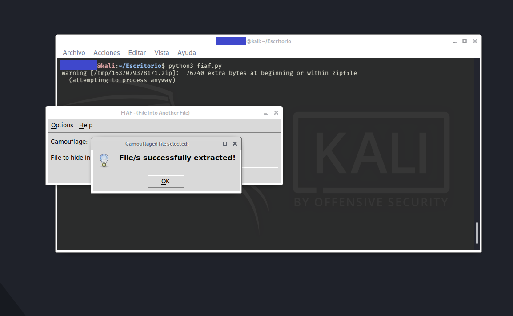

# FIAF - File Into Another File (EOF technique)

Python script for hide/unhide some files into another one.


## Installation

This tool require:
 

* Python3
* Python libraries: tkinter library (https://docs.python.org/es/3/library/tk.html)


```bash
sudo apt-get install python3-tk
git clone git@github.com:inchumi/FIAF.git
unzip FIAF.zip -d FIAF/
cd FIAF/
python3 fiaf.py
```
    
## Usage/Examples

```bash
kali@kali:~$ python3 FIAF.py 
```


## Screenshots



## Optimizations

Do it Multiplatform.

## Authors

 David Alejandro Cano | Email: davidalejandrocano@gmail.com | 
 Github: https://github.com/inchumi

